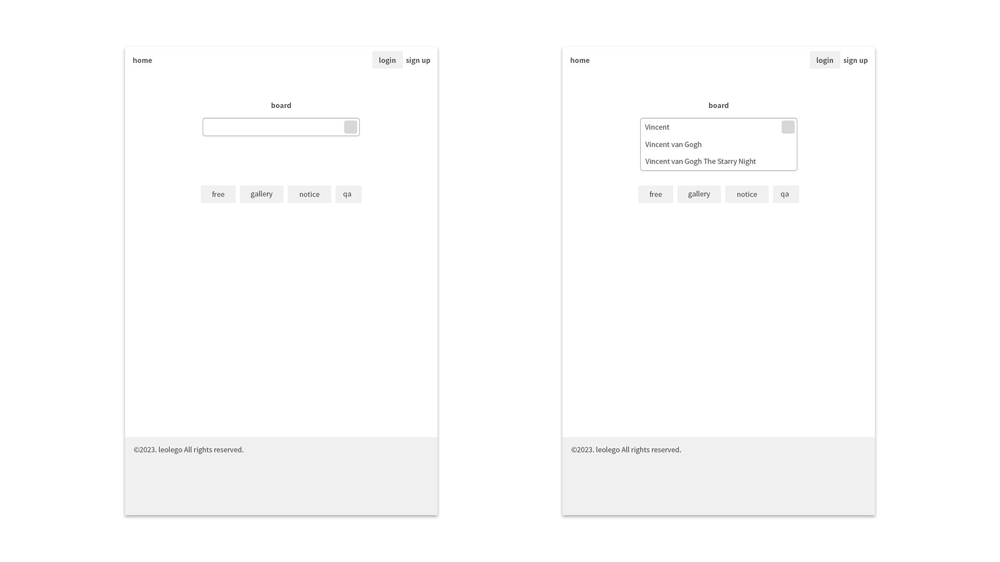
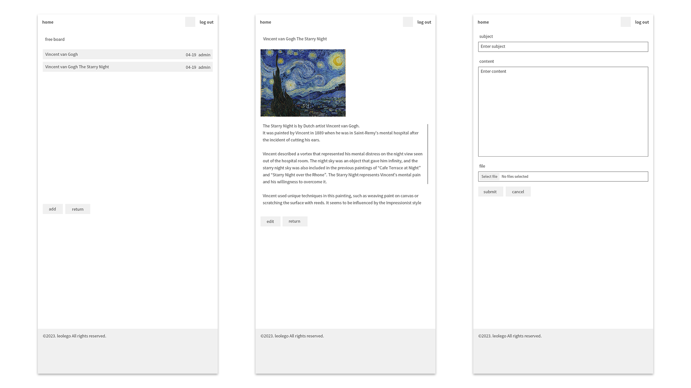

#### board-sdmjm
```
Board web application
```

+ Main function
  + Articles management
  + User authentication

+ Version
  + Java 8
  + Dynamic web module 4.0
  + Servlet 4.0.1
  + Spring framework 5.3.24
  + Tomcat v9.0
  
+ Template engine
  + JSP

+ RDBMS
  + MariaDB
  + MyBatis

#### Design
1. Main   


2. Board   


#### Database settings
1. Create a database   
Run queries in the MariaDB administrator tool
```
Open db.queries.txt in root:
  Copy and paste all queries into the query tab of the database administrator tool -> Run queries
```

2. Set database connection information
```
Move to WEB-INF:
  src -> main -> webapp -> WEB-INF

Create properties file:
  Create folder in WEB-INF named "properties" -> Create a file in properties named "db.properties"
  
Add value to "db.properties":
  db.classname = org.mariadb.jdbc.Driver
  db.url = jdbc:mariadb://localhost:3306/dbname
  db.username = username
  db.password = password
```

#### How to start
1. Run application   
Open the project on the IDE you're using
```
Eclipse:
  Import maven project -> Run as -> Run on server -> Choose an existing server -> Select Tomcat v9.0 Server at localhost -> Finish
```

2. Login   
Sign up for membership or log in with a tester account
```
Tester account:
  id: user
  password: ts!@1324
```